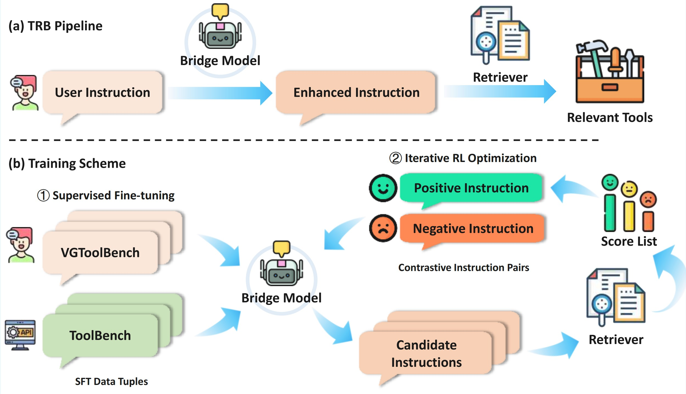

# 🛠️ Tool Retrieval Bridge: Aligning Vague Instructions with Retriever Preferences via a Bridge Model


### 🌟 Spotlight

* **VGToolBench:** A novel benchmark featuring vague, human-like instructions, addressing the mismatch between synthetic benchmarks and real-world tool use scenarios.
* **Tool Retrieval Bridge (TRB):** A plug-and-play instruction rewriting module that transforms vague queries into retriever-preferred formats, significantly improving tool retrieval across various retrievers.

<p align="center">
  
</p>


## 🛒Prepare

## 🔧 Environment Setup

1. **Create Conda Environment**

```bash
conda create -n toolretriever python=3.10
conda activate toolretriever
```

2. **Install Dependencies**

```bash
pip install -r requirements.txt
```

---
### 📂 Data Preparation

**Note:** You can directly download the processed data from our [Google Drive](https://drive.google.com/drive/folders/1xd7nQEodULkk-XHsNnf9PwnU9Vpsx-8I), which requires no further preprocessing.

#### ToolBench

1. Download the original ToolBench dataset from [Google Drive](https://drive.google.com/drive/folders/1yBUQ732mPu-KclJnuQELEhtKakdXFc3J) or [Tsinghua Cloud](https://cloud.tsinghua.edu.cn/f/c9e50625743b40bfbe10/), and place it under the `ToolBench/data` directory.

2. Run the preprocessing script to generate the train/test datasets:

```bash
python ToolBench/preprocess/preprocess_retriever_data.py
```

#### VGToolBench

Based on the processed ToolBench dataset, you can generate vague instructions using an LLM (requires an OpenAI, Qwen, or Deepseek API key):

```bash
python ./code/get_vague_data.py
```

---


## 🚀 Quick Start
```bash
cd code
bash exp_pipeline_run.sh

```

## 👀 Usage Guide


## 🏋️‍♂️ TRB Training

### ✨ Supervised Fine-Tuning (SFT)

1. **Generate SFT dataset**

```bash
python ./code/get_sft_data.py
```

2. **Run SFT training using [LLaMA-Factory](https://github.com/hiyouga/LLaMA-Factory)**

* Place the generated SFT dataset into `LLaMA-Factory/data/`
* Register it in `data/dataset_info.json`
* Then run training with the configuration in `code/train_configs/bridge_model_llama3_lora_sft.yaml`. Example configuration:

<details>
<summary>Click to view YAML config</summary>

```yaml
model_name_or_path: models/Llama-3.2-3B-Instruct
trust_remote_code: true

stage: sft
do_train: true
finetuning_type: lora
lora_rank: 8
lora_target: all

dataset: ******************************
template: llama3
cutoff_len: 1024
max_samples: 2000000
overwrite_cache: true
preprocessing_num_workers: 16
dataloader_num_workers: 4

output_dir: ******************************
logging_steps: 10
save_steps: 2000
plot_loss: true
overwrite_output_dir: true
save_only_model: false
report_to: none

per_device_train_batch_size: 16
gradient_accumulation_steps: 1
learning_rate: 5.0e-5
num_train_epochs: 3.0
lr_scheduler_type: cosine
warmup_ratio: 0.1
bf16: true
ddp_timeout: 180000000
resume_from_checkpoint: null
```

</details>

3. **Merge LoRA weights**

After training, use the LoRA merge command in LLaMA-Factory to obtain your SFT-finetuned TRB model.

---

### 💡 Direct Preference Optimization (DPO)

1. **Generate DPO dataset**

```bash
python ./code/get_dpo_data.py
```

As before, place the dataset into `LLaMA-Factory/data/` and register it in `data/dataset_info.json`.

2. **Run DPO training with config `code/train_configs/g3_bm25_llama3_lora_dpo.yaml`:**

<details>
<summary>Click to view YAML config</summary>

```yaml
model_name_or_path: models/my_bridge_model/sft_/G3
trust_remote_code: true

stage: dpo
do_train: true
finetuning_type: lora
lora_rank: 8
lora_target: all
pref_beta: 0.1
pref_ftx: 0.5
pref_loss: sigmoid  # [sigmoid, orpo, simpo]

dataset: dpo_g3_bm25
template: llama3
cutoff_len: 1024
max_samples: 3000000
overwrite_cache: true
preprocessing_num_workers: 16
dataloader_num_workers: 4

output_dir: *************************************************
logging_steps: 10
save_steps: 500
plot_loss: true
overwrite_output_dir: true
save_only_model: false
report_to: none

per_device_train_batch_size: 6
gradient_accumulation_steps: 1
learning_rate: 2.0e-5
num_train_epochs: 3.0
lr_scheduler_type: cosine
warmup_ratio: 0.02
bf16: true
ddp_timeout: 180000000
resume_from_checkpoint: null
```

</details>

3. **Merge LoRA weights**

Use the merge command again to obtain the TRB model finetuned with DPO.

---

## 🔍 TRB Inference & Evaluation

### 🔁 Inference (Enhanced Instruction Generation)

```bash
python code/get_rewrite_data_after_dpo.py
```

This script generates enhanced instructions using the trained TRB model.

### 📊 Evaluation

Use the same script to obtain retrieval performance scores:

```bash
python code/eval_retriever.py
```

---

